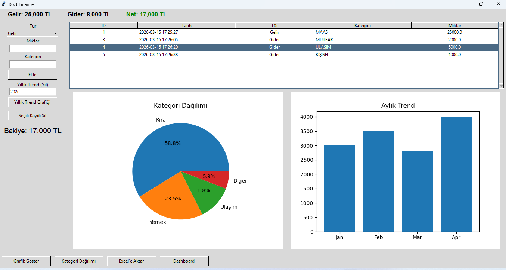

# Finance App

A Python desktop aplcation built with Tkinter.

This project fetches market data from an AP and displays it in a graphical interface with charts.

## Features

- API data fetching
- Market table display
- Interactive charts
- Tkinter GUI

## Screenshot

